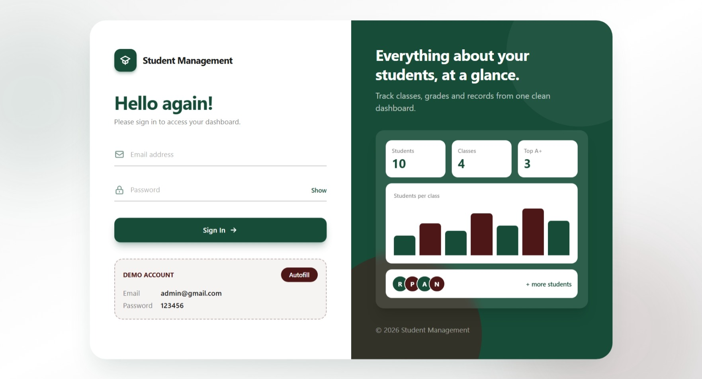
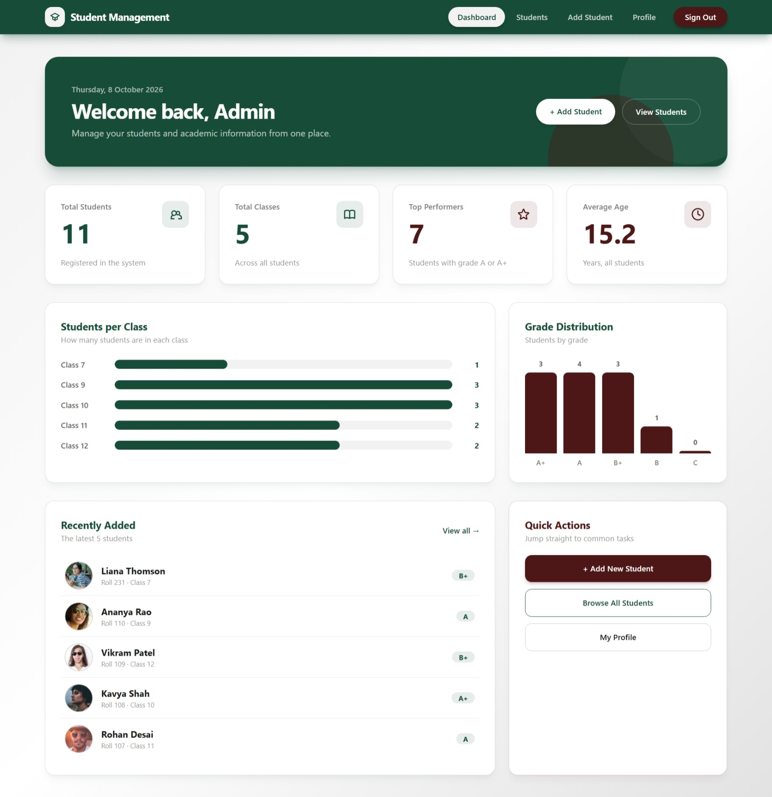
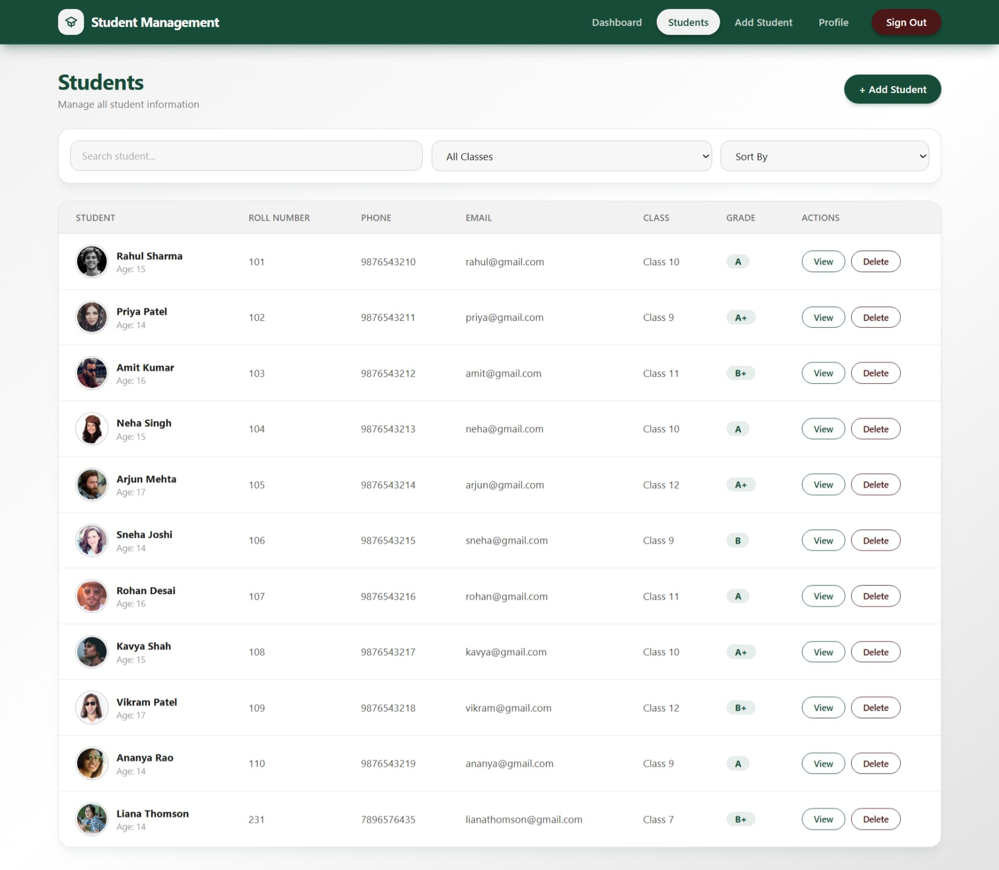
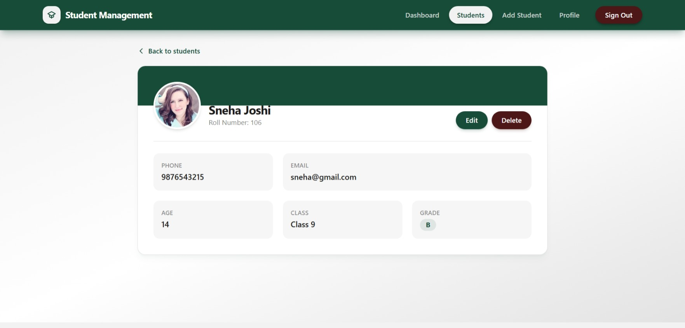
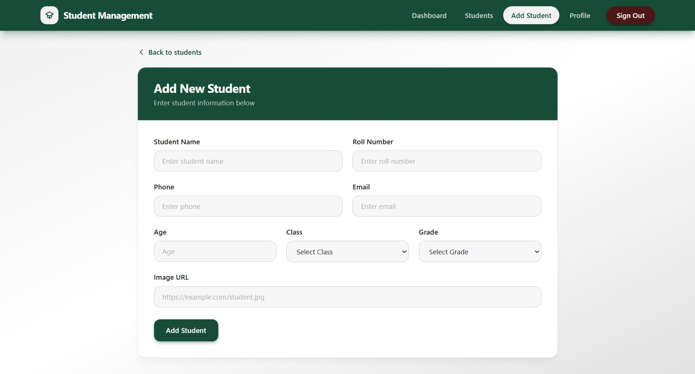
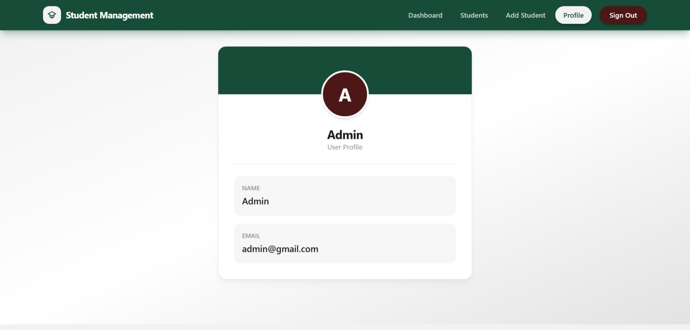

<div align="center">

# Project : Student Management System

**A responsive Student Management application built with React, Redux, Tailwind CSS and Flowbite React. The application allows an admin to log in, view a dashboard with statistics, and add, edit, delete, search, filter and sort student records, with all data served from a JSON Server REST API.**

</div>

---

## 📑 Table of Contents

* [Project Description](#-project-description)
* [How This Project is Made](#-how-this-project-is-made)
* [Features](#-features)
* [Technologies Used](#-technologies-used)
* [Installation](#-installation)
* [React Concepts Covered](#-react-concepts-covered)
* [How It Works](#-how-it-works)
* [Project Structure](#-project-structure)
* [Screenshot](#-screenshot)
* [Author](#-author)

---

## 📌 Project Description

The **Student Management System** is a single-page application built using **React, Redux and Tailwind CSS**.

The application starts with a login page. After signing in, the admin can see a dashboard with student statistics, browse all students in a table, open a student's detail page, add new students, edit existing records and delete students.

All data is stored in a `db.json` file and served through **JSON Server**, which acts as a fake REST API. Student records are fetched, created, updated and deleted using **Axios** requests.

This project was created to practice React concepts such as **useState, useEffect, controlled forms, React Router, protected routes, Redux state management, Redux Thunk, REST API integration, array methods, and responsive UI design with Tailwind CSS**.

---

## 🚀 How This Project is Made

This project is built using **React**, **Vite**, **Redux**, **React Router**, **Axios**, **Tailwind CSS v4** and **Flowbite React** to create a responsive and interactive **Student Management System**.

### 🧱 Application Structure

The application contains the following pages and components:

* **Login Page**

  * Email and password form
  * Show / Hide password
  * Demo credentials box
  * Error message for wrong credentials

* **Dashboard**

  * Welcome banner
  * Stat cards (Total Students, Total Classes, Top Performers, Average Age)
  * Students per Class chart
  * Grade Distribution chart
  * Recently Added students
  * Quick Actions

* **Students List**

  * Search, class filter and sort
  * Student table with image, roll number, phone, email, class and grade
  * View and Delete actions

* **Student Details**

  * Profile card with image, roll number and contact details
  * Edit and Delete buttons
  * Edit mode using the shared student form

* **Add Student**

  * Student form with validation

* **Profile**

  * Logged-in user's name and email

### 🎨 Tailwind CSS Styling

* Tailwind CSS v4 is used for the complete UI design.
* Custom colors are defined in `index.css` using the `@theme` block.
* The color palette is dark green (primary), dark maroon (accent), light gray (background) and silver gray (borders).
* Responsive grid layouts are created using Tailwind's grid utilities.
* Utility classes are used for spacing, borders, shadows, typography, gradients and responsive layouts.
* Hover, focus and active states are implemented using Tailwind utility classes.
* Flowbite React is installed for ready-made UI components.

### ⚙️ React Functionality

* `useState()` manages form fields, search text, class filter, sort option, password visibility and edit mode.
* `useEffect()` fetches students from the API when a page loads.
* Controlled inputs are used throughout the forms.
* **Redux** stores the logged-in user and the list of students.
* **Redux Thunk** handles asynchronous actions such as login, fetching, adding, updating and deleting students.
* **React Router** handles page navigation, nested layout routes and the protected route.
* **Axios** sends requests to the JSON Server API.
* Array methods such as `filter()`, `map()`, `sort()`, `reduce()` and `slice()` are used for searching, sorting and dashboard statistics.
* `window.confirm()` is used before deleting a student.

---

## ✨ Features

* Admin Login
* Protected Routes
* Logout
* Dashboard with Statistics
* Students per Class Chart
* Grade Distribution Chart
* Recently Added Students
* Add Student
* Edit Student
* Delete Student
* View Student Details
* Search Students by Name
* Filter Students by Class
* Sort Students by Name or Roll Number
* Loading Spinner
* Error Messages
* Empty State Message
* Responsive Navbar with Mobile Menu
* User Profile Page
* Responsive Tailwind CSS Design

---

## 🔧 Technologies Used

* React
* Vite
* Redux
* Redux Thunk
* React Router DOM
* Axios
* Tailwind CSS
* Flowbite React
* JSON Server
* JavaScript (ES6+)
* HTML5

---

## 📥 Installation

### Clone the Repository

```bash
git clone https://github.com/your-username/student-management.git
```

Move into the project folder:

```bash
cd student-management
```

### Install Dependencies

```bash
npm install
```

### Start the JSON Server

The student and user data is served from `db.json`. Open a terminal and run:

```bash
npm run server
```

The API will run on `http://localhost:3001`.

### Start the Development Server

Open a second terminal and run:

```bash
npm run dev
```

The application will run on `http://localhost:5173`.

### Demo Login

```text
Email    : admin@gmail.com
Password : 123456
```
---

## 📚 React Concepts Covered

* Functional Components
* `useState()`
* `useEffect()`
* Controlled Components
* Event Handling
* Form Handling
* React Router DOM
* Nested Routes and Layout Routes (`Outlet`)
* Protected Routes
* Redux Store, Actions and Reducers
* Redux Thunk (Async Actions)
* `useSelector()` and `useDispatch()`
* REST API Integration with Axios
* CRUD Operations
* Array Methods

  * `map()`
  * `filter()`
  * `sort()`
  * `reduce()`
  * `find()`
* Spread Operator
* Template Literals
* Conditional Rendering
* Reusable Components
* Responsive Design
* Tailwind CSS Utility Classes

---

## 🔄 How It Works

### 🔐 Login

The admin enters an email and password on the login page.

1. The `login` action sends the credentials to the JSON Server.
2. If a matching user is found, the user is saved in the Redux store.
3. The admin is redirected to the dashboard.
4. If the credentials are wrong, an error message is displayed.

### 🛡️ Protected Routes

All pages except the login page are wrapped in a `PrivateRoute`.

If the user is not logged in, they are redirected to the login page. The `Navbar` is used as a layout route, so every protected page is displayed inside its `<Outlet />`.

### ➕ Add Student

The admin fills out the student form with name, roll number, phone, email, age, class, grade and image URL.

After submitting:

1. The `addStudent` action sends a `POST` request to the API.
2. The new student is added to the Redux store.
3. The admin is redirected to the students list.

### ✏️ Edit Student

The **Edit** button on the details page switches the page into edit mode.

1. The selected student's data is loaded into the form.
2. The admin modifies the information.
3. After submission, the `updateStudent` action sends a `PUT` request.
4. The store is updated and edit mode is closed.

### 🗑️ Delete Student

The **Delete** button removes a student from the list or details page.

Before deleting, a confirmation dialog is displayed.

If the admin confirms:

1. The `deleteStudent` action sends a `DELETE` request.
2. The student is removed from the Redux store.
3. The table updates automatically.

### 🔍 Search, Filter and Sort

The students list supports three tools:

* **Search:** a case-insensitive search by student name using `filter()` and `includes()`.
* **Class filter:** shows only students of the selected class.
* **Sort:** sorts by name (alphabetical) or by roll number (numeric) using `sort()`.

All three can be combined at the same time.

### 📊 Dashboard Statistics

The dashboard calculates its numbers directly from the students in the Redux store:

* **Total Students:** the length of the students array.
* **Total Classes:** the number of unique classes using `Set`.
* **Top Performers:** students with grade A or A+.
* **Average Age:** calculated with `reduce()`.
* **Students per Class** and **Grade Distribution:** drawn as bar charts using Tailwind classes only, without any chart library.
* **Recently Added:** the latest 5 students.

### 💾 Data Storage

Data is stored in `db.json` and served by JSON Server.

```bash
json-server --watch db.json --port 3001
```

### 🗂️ Student Data Structure

Each student record contains:

```text
Student
│
├── id
├── name
├── rollNumber
├── phone
├── email
├── age
├── class
├── grade
└── image
```

---

## 📁 Project Structure

```text
student-management
│
├── db.json
├── index.html
├── package.json
├── vite.config.js
│
└── src
    ├── main.jsx
    ├── App.jsx
    ├── index.css
    │
    ├── components
    │   ├── Navbar.jsx
    │   ├── PrivateRoute.jsx
    │   ├── StudentList.jsx
    │   ├── StudentDetails.jsx
    │   └── StudentForm.jsx
    │
    ├── pages
    │   ├── Login.jsx
    │   ├── Dashboard.jsx
    │   ├── AddStudent.jsx
    │   └── Profile.jsx
    │
    └── redux
        ├── actions
        │   ├── authActions.js
        │   └── studentActions.js
        ├── reducers
        └── store.js
```

---

## 📸 Screenshot

### Sign In Page



### Dashboard



### Students List



### Student Details



### Add Student Form



### Edit Student Form



### Profile


---

## 💻 Author

<div align="center">

**Sakina Mufaddal Sendhi**

[](https://github.com/sakinasendhi52)

⭐ Thank you for visiting this repository!

</div>
